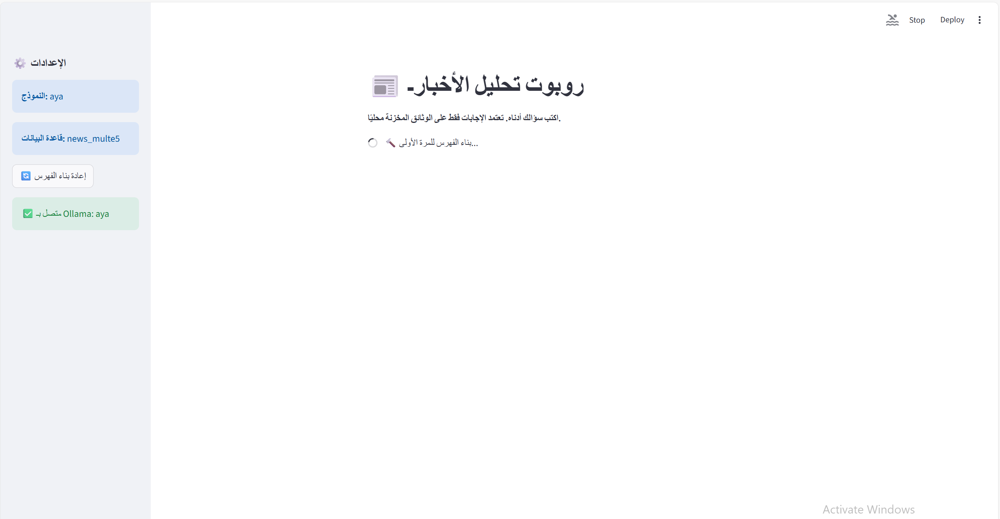

## RAG News Chatbot (Arabic)



An Arabic news analysis chatbot built with LlamaIndex, Qdrant (local vector DB), and Streamlit. It performs Retrieval-Augmented Generation (RAG) over local `.docx` news files stored in `news_documents/`. Answers are grounded strictly in your documents.

### Features
- Grounded Arabic answers using your local news corpus
- Local vector search via Qdrant (disk mode under `qdrant_data/`)
- Date-aware retrieval: filter results by a specific date or a date range
- Source transparency: shows which files contributed to the answer

---

## Project Structure
- `chat_with_news.py`: main Streamlit app with retrieval-time date filtering
- `news_documents/`: put your `.docx` news files here (filenames should include date)
- `qdrant_data/`: local Qdrant storage (created on first run)
- `requirements.txt`: Python dependencies
- `news_robot.png`: project image used in this README

---

## Prerequisites
- Python 3.10+
- Windows/macOS/Linux
- Ollama service running
  
Install dependencies:

```bash
pip install -r requirements.txt
```

---

## Preparing Your Data
1. Place `.docx` files in `news_documents/`.
2. Include a date in each filename in ISO format `YYYY-MM-DD`, for example:
   - `2024-07-04_politics_news.docx`
   - `2024-07-05-economy.docx`

The app extracts the date from the filename and stores it as metadata (`date`) per chunk, which enables fast date filtering in retrieval.

---

## Running the App
Launch Streamlit:

```bash
streamlit run chat_with_news.py
```

On first run, the app will:
- Load `.docx` documents
- Chunk them into nodes
- Embed and index into Qdrant under `qdrant_data/collection/news_multe5`

If you add, remove, or rename files later, click the sidebar button “إعادة بناء الفهرس” to rebuild the index.

---

## Using Date Filtering
You can type queries as usual in Arabic. If you include a date or a date range, the app filters results at retrieval-time so only matching nodes are fetched.

Supported formats (in English for convenience; you can still ask the question in Arabic — only the date tokens matter):
- Single date:
  - `YYYY-MM-DD` (e.g., `2024-07-04`)
  - `DD/MM/YYYY` or `DD-MM-YYYY`
  - `July 4, 2024` or `4 July 2024`
- Date ranges:
  - `YYYY-MM-DD to YYYY-MM-DD`
  - `DD/MM/YYYY to DD/MM/YYYY`
  - Relative: `last week`, `this month`, `next year`, `yesterday`, `today`, `tomorrow`

Examples:
- "ما أهم الأخبار الاقتصادية بتاريخ 2024-07-04؟"
- "أعطني ملخصًا لأبرز الأخبار من 2024-07-01 إلى 2024-07-07"

Notes:
- Date filtering relies on the `date` metadata extracted from filenames; ensure filenames contain a `YYYY-MM-DD` token.
- If you change filenames, rebuild the index from the sidebar.

---

## Troubleshooting
- No sources found for a date:
  - Verify the filename contains `YYYY-MM-DD`
  - Click “إعادة بناء الفهرس”
  - Try a broader range or larger `SIMILARITY_TOP_K`
- Performance/Memory:
  - Reduce `CHUNK_SIZE` (default set in `chat_with_news.py`)
  - Lower `SIMILARITY_TOP_K`

---

## License
This project is for educational purposes.

